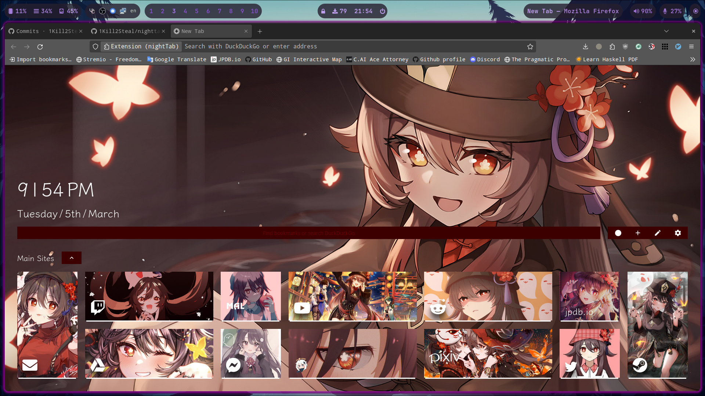

# NightTab Browser Theme

## Setting up

You actually just need the **JSON** file.
To use it you need to install the nightTab extension.

- [For Firefox](https://addons.mozilla.org/en-US/firefox/addon/nighttab/)
- [For Google](https://chromewebstore.google.com/detail/nighttab/hdpcadigjkbcpnlcpbcohpafiaefanki?hl=en-GB) - (Should work for Chrome-based browsers as well.)

### A guide on how to proceed with installing the theme:

- By GitHub user: [floorshame/nightTab-Themes](https://github.com/floorshame/nightTab-Themes?tab=readme-ov-file#1-how-to-install-themes)

## Themes

### Hu Tao theme

Amen

## What's the purpose of this repo?

Discord. They recently made all attachments last 24 hours (For more information about it - [bleepingcomputer.com](https://www.bleepingcomputer.com/news/security/discord-will-switch-to-temporary-file-links-to-block-malware-delivery/))
